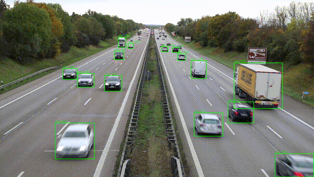

# perception_system

基于 ROS2 Lifecycle、CUDA 和 TensorRT 的实时感知示例系统。当前实现为四阶段目标检测流水线：

`Camera → ImageProc → Detector → Visualize`

各阶段以 `rclcpp_components` 形式运行在同一容器进程内，由生命周期状态机统一管理，支持运行时软重置。


---

## Overview

该项目主要用于演示以下几类工程实践：

- 基于 ROS2 Lifecycle 的组件化流水线管理
- 使用 `std::move` 传递大块图像数据，减少跨阶段拷贝
- 将预处理、推理和后处理拆分为独立 worker 组件
- 使用 CPU affinity 和 `SCHED_FIFO` 降低关键路径调度抖动
- 通过独立监控组件检测停滞并触发软重置
- 使用 `TraceStamp` 和 LTTng 记录端到端延迟

---

## Architecture

### High-level design

- **Pipeline topology:** `Camera → ImageProc → Detector → Visualize`
- **Zero-copy style transfer:** 原始图像数据嵌入消息后在阶段间通过 `std::move` 传递，减少冗余拷贝
- **Worker scheduling:** 关键阶段支持独立绑核，并可配置 `SCHED_FIFO`
- **Shared worker base:** `WorkerNode<MsgT>` 统一封装线程管理、消息槽和生命周期回调
- **Health monitoring:** `HealthMonitorComponent` 独立负责停滞检测和重置触发
- **Latency tracing:** `TraceStamp` 随消息流转，支持在线统计和离线 trace 分析

### Message flow

```text
CameraComponent
  →[camera/image_raw]→
ImageProcComponent
  →[camera/image_proc]→
DetectorComponent
  →[detector/inference_result]→
VisualizeComponent
  →[detector/detections]→ 输出
```

### Runtime components

所有组件运行在 `perception_container` 的 `MultiThreadedExecutor` 中。

| Component | Responsibility | Scheduling |
|---|---|---|
| `CameraComponent` | FFmpeg 解码并发布原始图像 | 无特殊要求 |
| `ImageProcComponent` | CUDA Letterbox 预处理 | `cpu=2`, `SCHED_FIFO prio=70` |
| `DetectorComponent` | TensorRT FP16 推理 | `cpu=3`, `SCHED_FIFO prio=80` |
| `VisualizeComponent` | YOLOv8 后处理和结果输出 | `cpu=4`, 普通调度 |
| `HealthMonitorComponent` | 检测管道停滞并触发重置 | 普通调度 |
| `LifecycleManager` | 编排 worker 组件生命周期状态切换 | 普通调度 |

### Worker hierarchy

```text
WorkerNode<MsgT>
   ├─ ImageProcComponent
   ├─ DetectorComponent
   └─ VisualizeComponent
```

`WorkerNode<MsgT>` 是模板基类，封装以下公共逻辑：

- latest-only 输入槽 `LatestSlot`
- 条件变量和 worker 线程
- `on_activate` / `on_deactivate` / `on_error` 生命周期入口
- 统一的 `StartWorker` / `StopWorker` 时序

---

## Features

| Feature | Description |
|---|---|
| Zero-copy style image transfer | 图像数据随消息通过 `std::move` 传递，减少大块内存拷贝 |
| CUDA preprocessing | 使用 GPU 执行 Letterbox 缩放和填充 |
| TensorRT FP16 inference | 加载预编译 `.engine` 文件并执行推理 |
| CPU affinity | 支持将 worker 线程绑定到指定 CPU 核心 |
| Real-time scheduling | 支持通过 `pthread_setschedparam` 配置 `SCHED_FIFO` |
| Worker base class | 用统一基类复用线程和生命周期管理逻辑 |
| Input freshness guard | 可配置最大输入年龄，丢弃过期帧 |
| Health monitoring | 监控关键阶段是否停滞，并触发软重置 |
| End-to-end latency stats | 定期输出 p50/p95/p99 延迟和帧率 |
| LTTng tracepoints | 支持使用 `babeltrace2` 做离线分析 |

---

## Design notes

### Zero-copy style message passing

原始图像数据嵌入 `ProcessedImage` 消息，在阶段间通过 `std::move` 传递。这样可以避免在 `ImageProc → Detector` 等路径上重复复制大块图像缓冲区。

### Shared worker base

`ImageProcComponent`、`DetectorComponent` 和 `VisualizeComponent` 具有相同的运行模式：

1. 订阅上游消息
2. 保存最新输入
3. 在独立线程中处理
4. 发布下游结果

这部分公共逻辑由 `WorkerNode<MsgT>` 提供，子类只需要实现具体处理过程。

### CPU affinity and scheduling

关键 worker 线程支持：

- 固定 CPU 核心
- 可选 `SCHED_FIFO` 优先级
- 权限不足时自动回退为普通调度

这样做的目标是降低调度抖动，而不是依赖所有环境都具备完整实时权限。

### Monitoring and reset flow

`HealthMonitorComponent` 只负责检测问题并发起请求；`LifecycleManager` 只负责执行生命周期状态切换。两者通过 service 解耦。

典型重置流程如下：

```text
HealthMonitor
  → call reset service
LifecycleManager
  → deactivate
  → cleanup
  → configure
  → activate
```

### End-to-end tracing

`TraceStamp` 记录关键阶段时间戳，例如：

- `t_cam_pub`
- `t_proc_in`
- `t_proc_out`
- `t_det_in`
- `t_det_out`

管道末端聚合这些时间戳并输出端到端延迟统计。启用 LTTng 时，也可以在用户态 trace 中查看更细粒度事件。

---

## Requirements

- Ubuntu 24.04
- ROS2 Jazzy
- CUDA 12.x
- TensorRT 10.7
- OpenCV 4.x
- FFmpeg
- C++17
- CMake 3.14+

可选依赖：

- LTTng

---

## Build

```bash
cd ~/ros2_perception_system

export VCPKG_ROOT=${HOME}/depends/vcpkg

rosdep install --from-paths perception_system --ignore-src -r -y

colcon build --packages-select perception_system \
  --cmake-args \
    -DCMAKE_BUILD_TYPE=Release \
    -DCMAKE_TOOLCHAIN_FILE=${VCPKG_ROOT}/scripts/buildsystems/vcpkg.cmake
```

构建完成后：

```bash
source install/setup.zsh
```

---

## Run

先设置运行时动态库路径：

```bash
export LD_LIBRARY_PATH=${VCPKG_ROOT}/installed/x64-linux-dynamic/lib:\
${HOME}/depends/tensorrt/TensorRT-10.7.0.23/lib:$LD_LIBRARY_PATH
```

启动系统：

```bash
ros2 launch perception_system perception_system.launch.py \
  detector_model_path:=/path/to/yolov8s-fp16-trt10.7.engine \
  camera_publish_rate_hz:=15.0
```

如果 `model_path` 为空，`DetectorComponent` 会进入开发模式，只透传消息，不执行推理。这个模式可用于在无 GPU 或无 engine 文件时调试其余流水线。

---

## Parameters

### ImageProc

| Parameter | Default | Description |
|---|---|---|
| `input_max_age_ns` | `0` | 输入新鲜度门限，`0` 表示关闭 |
| `worker_cpu` | `2` | worker 线程绑定 CPU |
| `worker_priority` | `70` | `SCHED_FIFO` 优先级 |

### Detector

| Parameter | Default | Description |
|---|---|---|
| `model_path` | `""` | TensorRT engine 路径；为空时进入开发模式 |
| `worker_cpu` | `3` | worker 线程绑定 CPU |
| `worker_priority` | `80` | `SCHED_FIFO` 优先级 |

### Visualize

| Parameter | Default | Description |
|---|---|---|
| `output_dir` | `/tmp/perception_output` | 输出结果保存目录 |
| `score_threshold` | `0.25` | 检测置信度阈值 |
| `iou_threshold` | `0.45` | NMS IoU 阈值 |

### HealthMonitor

| Parameter | Default | Description |
|---|---|---|
| `idle_cycle_limit` | `3` | 连续空闲周期达到该值时触发重置 |
| `reset_cooldown_sec` | `30` | 两次重置之间的最小间隔 |
| `input_fresh_sec` | `10` | 输入停止超过该时长时不触发重置 |

其他参数可以在 launch 时通过 `--ros-args -p <node_name>:<param>:=<value>` 覆盖。

---

## Observability

### Lifecycle state

```bash
ros2 lifecycle list /image_proc_node
ros2 lifecycle list /detector_node
```

### Topic throughput

```bash
ros2 topic hz /camera/image_raw
ros2 topic hz /camera/image_proc
ros2 topic hz /detector/inference_result
ros2 topic hz /detector/detections
```

### Manual reset

```bash
ros2 service call /lifecycle_manager/reset_node \
  perception_system/srv/ResetNode "{node_name: detector_node}"
```

### LTTng tracing

```bash
lttng create perception-session
lttng enable-event -u 'perception_system:*'
lttng start

ros2 launch perception_system perception_system.launch.py ...

lttng stop
babeltrace2 ~/lttng-traces/perception-session*/
```

---

## Repository layout

```text
perception_system/
├── include/
│   ├── common/
│   │   ├── affinity.hpp
│   │   ├── latest_slot.hpp
│   │   ├── latency_stats.hpp
│   │   ├── frame_rate_stats.hpp
│   │   └── trace.hpp
│   └── perception_system/
│       ├── worker_node.hpp
│       ├── camera_component.hpp
│       ├── image_proc_component.hpp
│       ├── detector_component.hpp
│       ├── visualize_component.hpp
│       ├── health_monitor_component.hpp
│       ├── lifecycle_manager.hpp
│       ├── preprocessing/
│       ├── inference/
│       └── visualize/
├── src/
│   ├── interfaces/
│   │   ├── msg/
│   │   │   ├── ProcessedImage.msg
│   │   │   ├── InferenceResult.msg
│   │   │   └── TraceStamp.msg
│   │   └── srv/
│   │       └── ResetNode.srv
│   ├── capture/
│   ├── preprocessing/
│   ├── inference/
│   ├── visualize/
│   ├── camera_component.cpp
│   ├── image_proc_component.cpp
│   ├── detector_component.cpp
│   ├── visualize_component.cpp
│   ├── health_monitor_component.cpp
│   ├── lifecycle_manager.cpp
│   └── perception_container.cpp
├── launch/
│   └── perception_system.launch.py
├── models/
├── CMakeLists.txt
└── package.xml
```

---

## Notes

- `SCHED_FIFO` 和 CPU affinity 依赖宿主机权限与系统配置
- 无实时权限时会自动回退，不影响基本功能
- `DetectorComponent` 的开发模式适合验证非推理路径
- 如果需要长期运行，建议结合系统级监控一起使用

